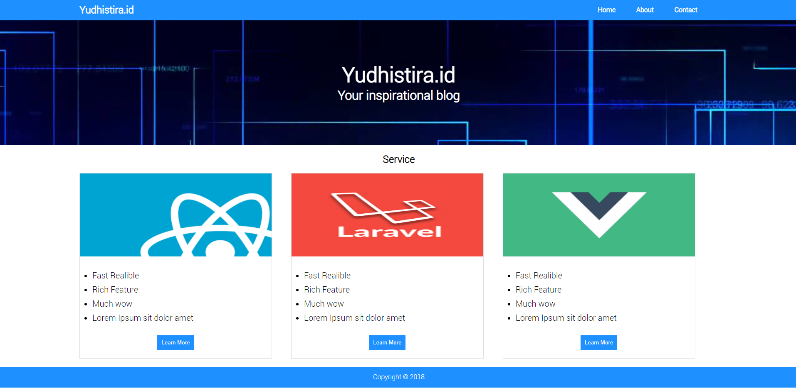

# Soal Frontend Developer

### 1.Pair Sock

Pair Sock adalah program yang memasangkan angka/data yang sama dalam array / list dengan hasil akhir berupa berapa pasang angka/data yang telah di pasangkan. 1 pasang hanya memiliki 2 angka/data yang sama.

contoh :

```js
var socks = [3, 5, 3, 6, 7, 5, 3, 4, 7, 6, 6];
```

jika kita perhatikan dengan seksama yang menjadi pasangan adalah

```
3 dengan 3
5 dengan 5
6 dengan 6
5 dengan 7

```

dengan demikian array ini memiliki 4 pasang socks. jadi hasil akhirnya adalah `4`

dan sisa angka yang tidak mendapat pasangan adalah

```js
[3, 4, 6];
```

jadi hasil akhir ( return ) dari program tersebut adalah :

```js
var socks = [3, 5, 3, 6, 7, 5, 3, 4, 7, 6, 6];

console.log(pairSock(socks)); // 4
```

Buatlah program tersebut dengan bahasa pemrograman javascript nodejs, dengan contoh input sebagai berikut :

```js
console.log(pairSock([10, 20, 20, 10, 10, 30, 50, 10, 20])); // 3
```

### 2. Landing Page

Buatlah landing page dengan layout seperti gambar berikut



menggunakan react js dengan folder project `yudhistira.id`. untuk referensi bisa melihat langsung layout live di [kunglaw.github.io](kunglaw.github.io)

petunjuk :

- kalian boleh menggunakan react css framework seperti react bootstrap, tailwind, ant design dll
- tidak terlalu mirip dengan tampilan tidak apa - apa karena mengikuti gaya css framework masing - masing
- usahakan warna dengan yang ada di contoh
- menu yang di atas kanan ganti dengan `Home ProvinsiAPI` saja
- menggunakan `react router` adalah nilai plus. dimana halaman landing dapat di akses oleh route `/` dan `/home`

tips :

- jangan terlalu berkutat dengan kemiripan jarak margin , padding, dan font
